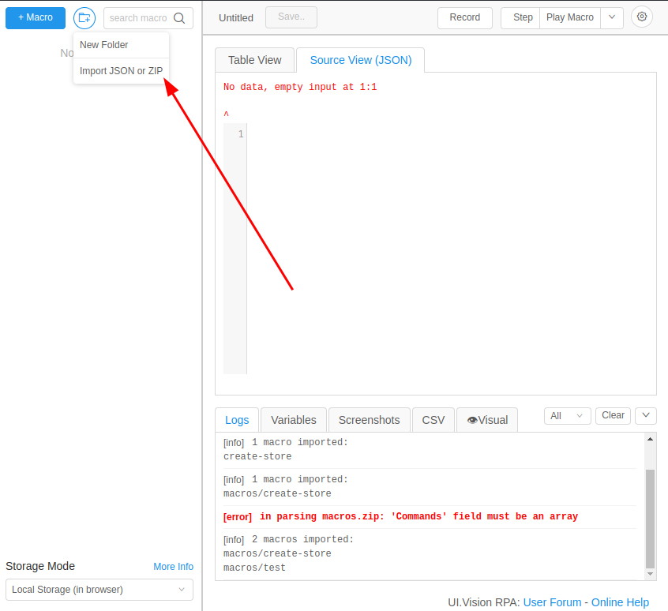
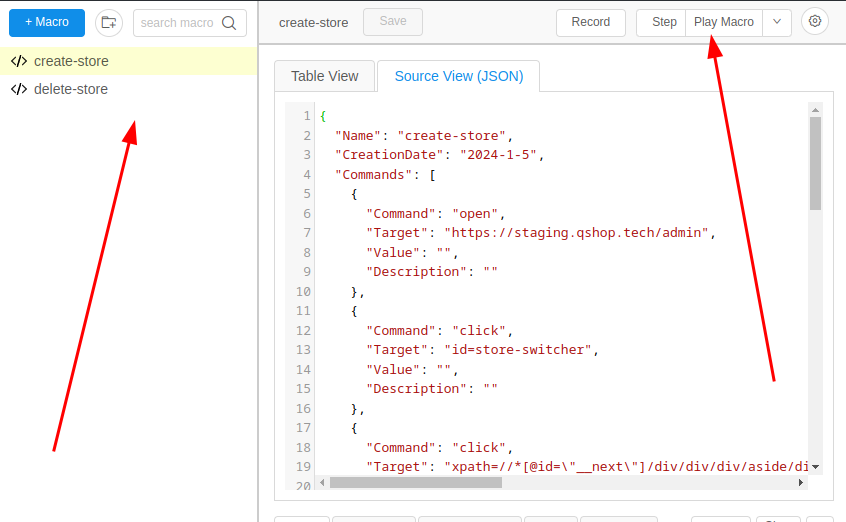

# qshop ui.vision-rpa macros

## Getting started
- install the UI.Vision RPA browser extension with the link below:
    - [Chrome](https://chromewebstore.google.com/detail/uivision-rpa/gcbalfbdmfieckjlnblleoemohcganoc)
    - [Firefox](https://addons.mozilla.org/en-US/firefox/addon/rpa/)

- head over to https://github.com/zt4ff/qshop-macros/blob/main/macros.zip and download the zip file

- open the extension (if this is your first time opening installing this extension, you'd see a demo macros, you can delete that - right click on it to delete it)

- click on the new folder button on UI.Vision and select `Import JSON or ZIP` as below:

- then import the zip file you just downloaded. Importing the `macros.zip` file exposes a list of macros you can run. for example

- then you can run a macros - in our case, a single task, by clicling the `Play Macro` on the right as display in the image above 

## Notes
- the macros can't run on an Incognito tab
- the macros assumes you are logged in on an overview page with no modal showing when you load the page