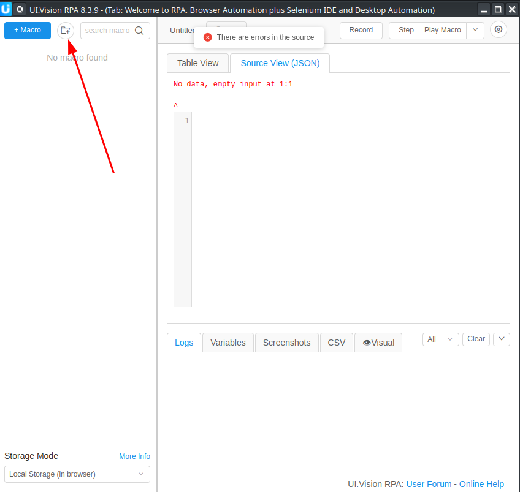

# qshop ui.vision-rpa macros

## Getting started
- install the UI.Vision RPA browser extension with the link below:
    - [Chrome](https://chromewebstore.google.com/detail/uivision-rpa/gcbalfbdmfieckjlnblleoemohcganoc)
    - [Firefox](https://addons.mozilla.org/en-US/firefox/addon/rpa/)

- open the extension (if this is your first time opening installing this extension, you'd see a demo macros, you can delete that - right click on it to delete it)

- create a new folder and name it "QShop" via the button below

- click on the new folder you created and 
